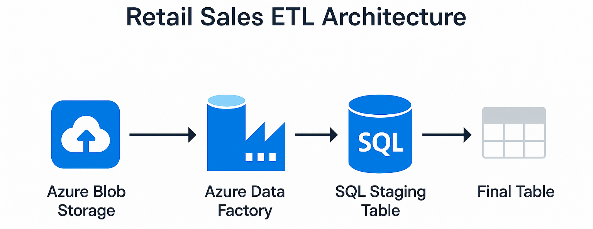
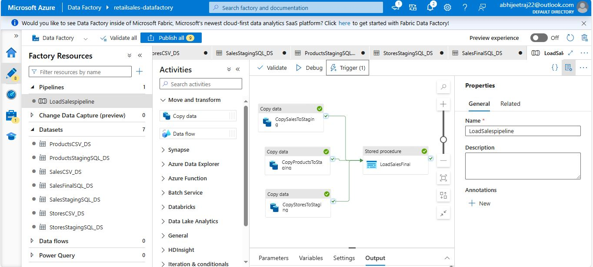

# 🛒 Azure Data Factory ETL Project – Retail Sales Data


This project implements a real-world **ETL pipeline using Azure Data Factory (ADF)** to ingest retail sales data from **Azure Blob Storage (CSV files)** and load it into **Azure SQL Database**, following modern data engineering practices.

> 🔗 GitHub Repo: [AzureDataFactortETL-Project](https://github.com/abhijeetraj22/AzureDataFactortETL-Project)

---

## 📌 Project Objective

Build an end-to-end **ETL solution** that:
- Ingests sales, stores, and product data from **CSV files** in **Azure Blob Storage**
- Loads it into **staging tables** in **Azure SQL Database**
- Transforms and writes final clean data to **SalesFinal** table
- Uses **ADF Pipelines and Triggers** to automate the process

---
## 🧭 Architecture Overview

<p align="center">
  
</p>

---

## 🗂️ Folder Structure
```bash
│   publish_config.json                # Publish configuration for Azure Data Factory deployment
│   README.md                          # Project documentation file
├───dataset                          
│   ├── ProductsCSV_DS.json            # Dataset pointing to the 'Products' CSV file in Blob Storage
│   ├── ProductsStagingSQL_DS.json     # Dataset for 'Products' staging table in Azure SQL
│   ├── SalesCSV_DS.json               # Dataset pointing to the 'Sales' CSV file in Blob Storage
│   ├── SalesFinalSQL_DS.json          # Dataset for final transformed Sales table in Azure SQL
│   ├── SalesStagingSQL_DS.json        # Dataset for 'Sales' staging table in Azure SQL
│   ├── StoresCSV_DS.json              # Dataset pointing to the 'Stores' CSV file in Blob Storage
│   ├── StoresStagingSQL_DS.json       # Dataset for 'Stores' staging table in Azure SQL
├───factory                          
│   └── retailsales-datafactory.json   # Factory-level deployment template (ADF resources: datasets, pipelines, triggers)
├───linkedService                   
│   ├── AzureBlobStorageRS.json        # Linked Service for Azure Blob Storage
│   └── AzureSqlDatabaseRS.json        # Linked Service for Azure SQL Database
├───pipeline                        
│   └── LoadSalespipeline.json         # Main ETL pipeline to load data from Blob to SQL (staging to final)
└───trigger                           
    └── trigger1.json                  # Time-based or scheduled trigger for running LoadSalespipeline
```

---

## 🚀 Step-by-Step Guide

### 🔹 Step 1: Clone the Repository
```bash
git clone https://github.com/abhijeetraj22/AzureDataFactortETL-Project.git
cd AzureDataFactortETL-Project
```

---

### 🔹 Step 2: Set Up Azure Resources

- ✅ **Azure Blob Storage**
  - Create a storage account
  - Upload sample: `Products.csv`, `Stores.csv`, `Sales.csv` into a container

- ✅ **Azure SQL Database**
  - Create a database with necessary staging and final tables

---

### 🔹 Step 3: Deploy ARM Template to Azure Data Factory

- Go to your Azure Data Factory
- Navigate to: `Manage > ARM Template`
- Import: `factory/retailsales-datafactory.json`

This will create:
- Pipelines
- Datasets
- Linked Services
- Triggers

---

### 🔹 Step 4: Configure Linked Services

- Edit the following files (or update from ADF UI):
  - `linkedService/AzureBlobStorageRS.json`: Add your Storage account key or connection string
  - `linkedService/AzureSqlDatabaseRS.json`: Add SQL server name, database name, username, and password

---

### 🔹 Step 5: Validate and Run the Pipeline

1. Open `LoadSalespipeline` in Author pane
2. Click **Debug** to test
3. Publish changes
4. Enable `trigger1.json` to schedule automation

---
## 📸 Azure Data Factory

<p align="center">
  
  <br>
</p>

---

## 📊 Key Components

| Type          | File Name                    | Description                          |
|---------------|------------------------------|--------------------------------------|
| LinkedService | AzureBlobStorageRS.json      | Connection to Azure Blob Storage     |
| LinkedService | AzureSqlDatabaseRS.json      | Connection to Azure SQL Database     |
| Dataset       | SalesCSV_DS.json             | Input: Sales CSV dataset             |
| Dataset       | SalesStagingSQL_DS.json      | Output: Staging table in SQL         |
| Dataset       | SalesFinalSQL_DS.json        | Output: Final table in SQL           |
| Pipeline      | LoadSalespipeline.json       | Main ETL logic                       |
| Trigger       | trigger1.json                | Scheduled trigger to run the pipeline|

---

## 🧠 Tools & Skills Demonstrated

- ✅ Azure Data Factory (ADF)
- ✅ Azure Blob Storage
- ✅ Azure SQL Database
- ✅ ETL/ELT Pipelines
- ✅ ARM Template Deployment
- ✅ Linked Services, Datasets, Triggers
- ✅ Real-World Data Engineering Workflow

---
## Connect with me! 🌐

[](https://www.linkedin.com/in/rajabhijeet22/)       [](https://github.com/abhijeetraj22)     [](https://www.instagram.com/abhijeet_raj_/?hl=en) [](https://twitter.com/abhijeet_raj_/)

